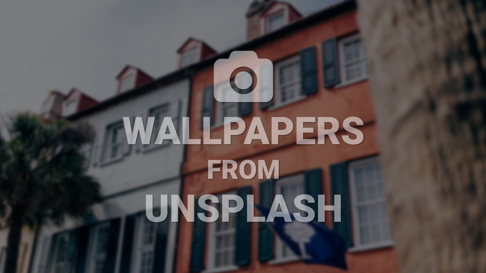

# Wallpapers from Unsplash
A collection of Terminal commands and an Alfred workflow that allow Mac users to replace their desktop background(s) with photos from the popular [Unsplash.com](http://unsplash.com). 

> Additional information is available on [adamdehaven.com](http://adamdehaven.com/blog/2016/04/wallpapers-from-unsplash-terminal-commands-and-alfred-workflow)



-----
- [What's Included?](#whats-included)
- [Installation](#installation)
  - [<strong>REQUIRED! - Rename Directory</strong>](#required---rename-directory)
  - [Alfred Workflow](#alfred-workflow)
  - [Bash Commands and Alias for Terminal](#bash-commands-and-alias-for-terminal)
- [FAQ](#faq)
- [Support](#support)
- [License](#license)

-----

<br>

## What's Included?
* [Alfred Workflow](#alfred-workflow)
* [Terminal commands and alias](#bash-commands-and-alias-for-terminal) utilizing an AppleScript via the command line

## Installation

-----
#### REQUIRED! - Rename Directory
**After downloading the source files, YOU MUST rename the `Wallpapers-from-Unsplash-master` directory that is created when you download this repository.**

##### The folder must be renamed `Wallpapers-from-Unsplash`. 

After renaming the folder `Wallpapers-from-Unsplash` you may relocate the folder anywhere you'd like on your Mac (within your user account).

-----

### Alfred Workflow
Install the 'Wallpapers-from-Unsplash' [Alfred](https://www.alfredapp.com/) workflow simply by double-clicking the `Wallpapers-from-Unsplash.alfredworkflow` file. Once installed, the AlfredApp workflow allows for 10 different keyword methods, along with 3 configuration methods:

KEYWORD|ARGUMENT|DESCRIPTION
:---:|:---:|:---
`unsplash`|none|Replaces the desktop background(s) with a random photo from Unsplash
`featured`|none|Replaces the desktop background(s) with a random **featured** photo from Unsplash
`search`|`comma-separated keyword(s)`|Replaces the desktop background(s) with a random photo matching the **search keyword(s)** from Unsplash. Separate keywords with commas and **NO spaces**.<br><br>**_Example:_** `search sunrise,city`
`category`|`valid category string`|Replaces the desktop background(s) with a random photo from the **specified category** from Unsplash. Available categories: buildings, food, nature, people, technology, objects.<br><br>**_Example:_** `category food`
`collection`|`collection id`|Replaces the desktop background(s) with a random photo from the **specified collection** from Unsplash.<br><br>**_Example:_** `collection 165921`
`username`|`string`|Replaces the desktop background(s) with a random photo from the **specified user's** photos from Unsplash.<br><br>**_Example:_** `username stvcrtr`
`fetch`|`photo id`|Replaces the desktop background(s) with a **specified photo** from Unsplash.<br><br>**_Example:_** `fetch KqVHRmHVwwM`
`monitor`|`integer`|Replaces the desktop background specified by the `integer` with a random photo from Unsplash.<br><br>**_Example:_** `monitor 2`
`save`|`integer`|Saves the current desktop background specified by the `integer` to the `Wallpapers-from-Unsplash/images/saved-wallpapers/` directory.<br><br>**_Example:_** `save 2`
`load`|none|Replaces the current desktop background(s) with a random saved photo from `Wallpapers-from-Unsplash/images/saved-wallpapers/`
**USER**|**CONFIG**|**METHODS**
`setpath`|`filepath`|Sets the path of the `Wallpapers-from-Unsplash/` directory. Type the keyword `setpath` followed by `Wallpapers-from-Unsplash`and then select the correct folder in Alfred.<br><br>**_Required Usage:_** `setpath Wallpapers-from-Unsplash`
`desktopwidth`|`integer`|Sets the desktop width at which to download photos.<br><br>**_Default:_** `desktopwidth 2560`
`desktopheight`|`integer`|Sets the desktop height at which to download photos.<br><br>**_Default:_** `desktopheight 1440`


### Bash Commands and Alias for Terminal

Once you have downloaded the repository and saved to your Mac, you can set up a shortcut (an alias) to also change the desktop background(s) via Terminal (bash) commands. To set up, open **Terminal** on your Mac and execute the following commands:

```bash
# go to your home directory

$ cd

# Open your Mac's .bash_profile in the editor of your choice.
# In this example, I open .bash_profile with Sublime Text.
# If a .bash_profile does not exist, you can first create 
# one by running: $ cd ~/ && touch .bash_profile

$ open -a "Sublime Text" .bash_profile
```

Insert and save the following lines at the bottom of your `.bash_profile`. You will need to **edit the path preceeding the `unsplash.scpt` file to match the directory where you saved the repository**. Note the `~/` before the start of the path that **must** be included. The easiest way to attain the path is to drag the `Wallpapers-from-Unsplash` folder icon onto your Terminal window. Replace `/Users/username/` with `~/` so that the final result looks similar to this:

```bash
alias unsplash="osascript ~/Dropbox/Development/Wallpapers-from-Unsplash/unsplash.scpt"
```

Now you may easily run the script from the command line with any of the [commands listed in the table above](#alfred-workflow). You may view the info below by running `unsplash --help` on the command line:

```bash
$ unsplash --help

#
#   You may use the command 'unsplash' on it's own
#   to fetch random wallpapers for your desktop(s).
#   Alternatively, you may use one of the following
#   arguments for more options:
#       $ unsplash
#       $ unsplash featured
#       $ unsplash search [keyword,keyword]
#       $ unsplash category [category id]
#       $ unsplash collection [collection id]
#       $ unsplash username [username]
#       $ unsplash fetch [photo id]
#       $ unsplash monitor [monitor #]
#       $ unsplash save [monitor #]
#       $ unsplash load
#   
#   You may set your desktop dimensions by
#   using 'width' and 'height'.
#       $ unsplash width [integer]
#       $ unsplash height [integer]
#
#   To view this info again, use $ unsplash --help
#
```

-----

## FAQ
**If installing the AlfredApp workflow, do I need to have the [Alfred Powerpack](https://www.alfredapp.com/powerpack/)?**
> **Yes.**<br> You must purchase the Alfred Powerpack in order to add custom workflows.

**If I just want to utilize the Terminal commands, do I need to be an [Alfred](https://www.alfredapp.com/) user?**
> **No!**<br> Just check out the [Bash Alias for Terminal](#bash-alias-for-terminal) section to get started.

**I'm not a "power-user" and am unfamiliar with using Terminal or command line tools. Is this for me?**
> **Yes!**<br> The installation and usage instructions outlined below are simple and should have you up and running in minutes! Have a question? No problem, I'm here to help. Check out the [Support](#support) section on how to get in touch.

**Why must I rename the `Wallpapers-from-Unsplash-master` directory?**
> Because of the methods used to fetch, store, and load photos from the Unsplash API as well as from your local machine, the directory name **must** be changed to `Wallpapers-from-Unsplash` and remain the same (and hopefully unique) in order to ensure proper file handling. This becomes increasingly important if you are an Alfred user who sync's workflows across multiple computers (via Dropbox, etc.).

## Support
Do you have questions? Would you like to contribute? Something else? Feel free to fork the project, [open an issue](https://github.com/adamdehaven/Wallpapers-from-Unsplash/issues), or submit a pull request. 

Not into looking at code? No worries. Reach out on Twitter [@adamdehaven](http://twitter.com/adamdehaven).

## License
Released under the [MIT License](https://github.com/adamdehaven/Wallpapers-from-Unsplash/blob/master/LICENSE).